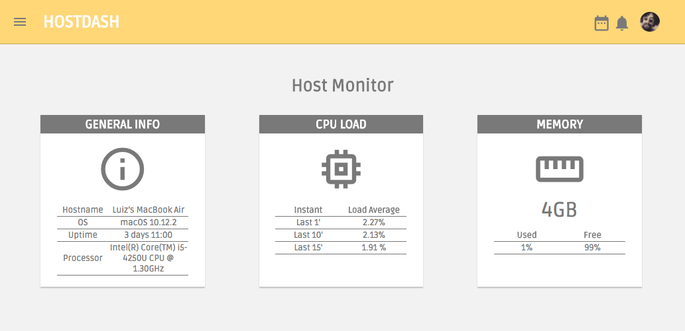

# Prova DW - Javascript

### OBSERVAÇÕES

Leia as observações a seguir:

* A avaliação será realizada no computador, porém individualmente e em silêncio. Não deve haver nenhum tipo de comunicação entre os alunos;
* Cada questão é expresso através dessa indicação **(DD%)** que significa o critério de pontuação, contudo, contudo, a desorganização pode penalizar a pontuação final;
* No arquivo de resposta inclua um bloco de comentário no início de seu conteúdo com o nome e a matrícula do aluno;
* Ao concluir as questões chame o professor para avaliar a prova;
* Depois da avaliação envie os arquivos num diretório compactado, seguindo o formato de nome **ALUNO-MATRICULA** para o email **lucachaves+avaliacoesdw20162@gmail.com** com:

> **Assunto:** [IFPB] Prova I DW

> **Conteúdo:** Os arquivos da prova do aluno < nome do aluno > (< matrícula >) estão em anexo.

### DESCRIÇÃO DA PROVA

As questões da prova serão relacionadas ao layout da página Web da Figura 1, no qual os recursos necessários para a página serão disponibilizados através deste [link](https://github.com/ifpb/dw/blob/master/assessment/prova-html-css/code.zip).

*Figura 1 - Layout da página*

Resumidamente o layout é dividido em duas áreas principais, o cabeçalho e a área principal de conteúdo. Cada uma dessas áreas apresentam itens com aparências específicas, que devem ser preservados o mais próximo possível do comportamento  estrutural e do estilo apresentado na Figura 1.

Para facilitar nesse processo, cada questão abordará um item específico, no qual seu conteúdo será previamente disponibilizado por meio dos arquivos baixados que já incluem o HTML e CSS necessário. Por exemplo, uma das questões solicitará a criação e estilização dos paineis de informações do Host selecionado, e como ponto de partida, os arquivos baixados já disponibilizam a estrutura e estilo tabela para preencher as informações de um host específico.

Para coletar tais informações será necessário fazer uso de um sistema que disponibiliza um serviço de coleta de dados do host através de uma API Web. Para realização da prova será considerado que os experimentos possuem o cenário da Figura 2, no qual qualquer computador pode acessar as rotas do servidor Monitor API.

*Figura 2 - Cenário de consumo do Monitor API Server*

Tal serviço pode ser bastante útil para atividades de monitoramento, e pode ser implementado através do projeto (monitor-api)[https://github.com/lucachaves/monitor-api], que descreve as rotas disponível, junto com o processo de instalação e execução do serviço.

Uma das rotas que será útil para essa prova será o `/v1/memory`, que através do método GET executa o comando que coletado no servidor Monitor API as porcentagens de uso da memória. Para saber mais detalhes sobre as outras rotas disponíveis basta acessar a rota `/v1`.

### QUESTÕES

**QUESTÃO 1 -** No Layout da Figura 1 é possível identificar que existe os paineis de informações do Host selecionado, apresentado através dos recortes das Figura 3 até a Figura 5. Todas as estruturas e estilos necessários para essa ilustração estão disponibilizadas. Então, através do Monitor API construa o:

  **a. (O 33%)** Painel de informações dos hosts conforme a Figura 3.

  **b. (E 33%)** Painel sobre a Carga da CPU conforme a Figura 4.

  **c. (O 33%)** Painel sobre a Carga da Memória conforme a Figura 5.

*Figura 3 - Painel de informações dos hosts.*

*Figura 4 - Painel sobre a Carga da CPU.*

*Figura 5 - Painel sobre a Carga da Memória.*

