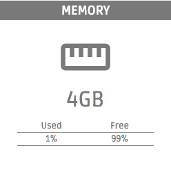

# Prova DW - Javascript

### OBSERVAÇÕES

Leia as observações a seguir:

* A avaliação será realizada no computador, porém individualmente e em silêncio. Não deve haver nenhum tipo de comunicação entre os alunos;
* Cada questão é expressa através dessa indicação **(DD%)** que significa o critério de pontuação, contudo, a desorganização pode penalizar a pontuação final;
* No arquivo de resposta inclua um bloco de comentário no início de seu conteúdo com o nome e a matrícula do aluno;
* Ao concluir as questões chame o professor para avaliar a prova;
* Depois da avaliação envie os arquivos num diretório compactado, seguindo o formato de nome **ALUNO-MATRICULA** para o email **lucachaves+avaliacoesdw20162@gmail.com** com:

> **Assunto:** [IFPB] Prova I DW

> **Conteúdo:** Os arquivos da prova do aluno < nome do aluno > (< matrícula >) estão em anexo.

### DESCRIÇÃO DA PROVA

As questões da prova serão relacionadas ao layout da página Web da Figura 1, no qual os recursos necessários para a página serão disponibilizados através deste [link](https://github.com/ifpb/dw/blob/master/assessment/prova-php/code.zip).

*Figura 1 - Layout da página*


Resumidamente o layout é dividido em duas áreas principais, o cabeçalho e a área principal de conteúdo. Cada uma dessas áreas apresenta itens com aparências específicas, que devem ser preservados o mais próximo possível do comportamento  estrutural e do estilo apresentado na *Figura 1*.

Para facilitar esse processo, cada questão abordará um item específico, no qual seu conteúdo será previamente disponibilizado por meio dos arquivos obtidos, que já incluem o HTML, o CSS e o JS necessário.

Por exemplo, uma das questões solicitará a coleta de informações de um Host para ser exibido em um painel, utilizando dados por meio de uma API. Como ponto de partida, os arquivos obtidos já disponibilizam a estrutura, o estilo e o script dos paineis que serão alimentados com dados advindos de rotas pré-definidas. Então, através da rota `v1/stats.php?info=overview` será executado alguns comandos que coletarão no servidor Monitor API alguns dados, como **hostname** e **uptime**, para se transformar no JSON da resposta da rota.

Para realização da prova será considerado que os experimentos possuem o cenário da *Figura 2*, no qual qualquer computador pode acessar as rotas do servidor Monitor API.

*Figura 2 - Cenário de consumo do Monitor API Server*


Tal serviço pode ser bastante útil para atividades de monitoramento, pois evita o uso de sistemas mais complexos de monitoramente, e ao mesmo tempo evita o uso excessivo manual de comandos no terminal.

### QUESTÕES

**QUESTÃO 1 -** No Layout da *Figura 1* é possível identificar que existe os painéis de informações do Host selecionado, apresentado através dos recortes das *Figura 3* até a *Figura 5*. Todas as informações necessárias para a construção dessas ilustrações estarão disponibilizadas a seguir. Então, através do código obtido do Monitor API construa:

**a. (33%)** O Painel de informações do host conforme a *Figura 3*.

*Figura 3 - Painel de informações do host.*


Lembrando que as rotas devem ser usadas para a construção desse painel são o `v1/stats.php?info=overview` e o `v1/stats.php?info=cpuName`.

Na rota `v1/stats.php?info=overview` deve retorna algo como:

```
{
  operatingSystem: "Ubuntu 16.04.2 LTS ",
  hostname: "ubuntu-xenial ",
  username: "www-data ",
  uptime: "1 hour, 9 minutes "
}
```

Já a rota `v1/stats.php?info=cpuName` deve retorna algo como:

```
{
  cpu: "Intel(R) Core(TM) i5-4250U CPU @ 1.30GHz"
}
```

**b. (33%)** O Painel sobre a carga da CPU conforme a *Figura 4*.

*Figura 4 - Painel sobre a carga da CPU.*


Para a construção desse painel é necessário utilizar a rota  `v1/stats.php?info=cpuStatus`, que deve retornar algo como:

```
{
  cpuLast: {
    last1: 0,
    last10: 0,
    last15: 0
  }
}
```

**c. (33%)** O Painel sobre a carga da memória conforme a *Figura 5*.

*Figura 5 - Painel sobre a carga da memória.*



Para a construção desse painel é necessário utilizar a rota  `v1/stats.php?info=memory`, que deve retornar algo como:

```
{
  memoryUsageUsed: 7.7,
  memoryUsageUnused: 92.3
}
```
